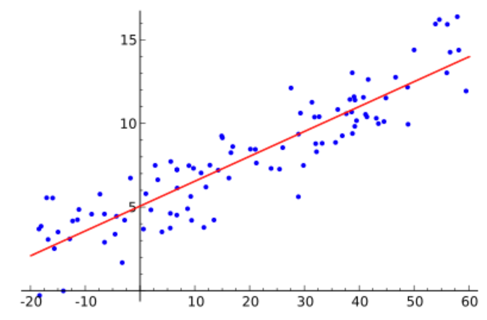

# 1. 线性回归（Linear Regression）

## 1.1 引言

线性回归，构造一条直线来拟合带有近线性规律的数据。如:

## 1.2 模型

根据直线方程，可将线性回归表示为：
$$
h(x) = w_1x^{(1)}+w_2x^{(2)} + ... + w_nx^{(n)} + b  \tag1
$$
其中：

* $x$为输入数据
* $x^{(1)}$、$x^{(2)}$、$x^{(3)}$ 、...、$x^{(n)}$为输入数据的各列属性特征
* $w_1$、$w_2$、$w_3$、...、$w_n$为线性回归模型参数
* $b$为线性回归模型偏置项
* $h(x)$ 为模型预测输出

对$w$、$x$进行向量化表示:
$$
w = (w_1,w_2,w_3,...,w_n)^T \tag2
$$

$$
x = (x^{(1)},x^{(2)},x^{(3)},...,x^{(n)}) ^T \tag3
$$

将公式(2)、公式(3)，代入公式（1）得到：
$$
h(x) = w^Tx+b \tag4
$$

## 1.3 评估方法

线性回归的预测及真实标签均为实数值，损失函数可以使用MSE（Mean Squre Error，平均均方误差）。
$$
\begin{align}
L &= \frac{1}{2m}\sum_{i=1}^{m}[h(x_i)-y_i]^2 \tag5 \\
   &= \frac{1}{2m}\sum_{i=1}^{m}[w^Tx_i+b-y_i]^2 \tag6
\end{align}
$$
其中：

* m为样本数量
* $y_i$为第$i$ 个样本的真实标签
* 对MSE除以2是为了参数求解的方便

## 1.4 参数求解

根据1.3中提到的评估方法，通过变化模型参数可以降低误差使得模型达到最优。相反地，对误差进行极小化操作得到参数便是最优参数、最优模型，即：
$$
(w^{'}, b^{'}) = argmin_{(w,b)} \frac{1}{2m}\sum_{i=1}^{m}[w^Tx_i+b-y_i]^2 \tag7
$$
线性回归参数的常用求解方法包括：（1）解析解（最小二乘法）、（2）梯度下降法。

### 1.4.1 解析解（最小二乘法）

当偏导数为0时，函数取得极小值。
$$
\begin{align}
	\frac{\partial L}{\partial w} &= \frac{\partial \frac{1}{2m}\sum_{i=1}^{m}[wx_i+b-y_i]^2}{\partial w} \tag8 \\
										   &= \frac{1}{m}\sum_{i=1}^{m}(wx_i+b-y_i)x_i  \tag9
	
\end{align}
$$

### 1.4.2 梯度下降法

## 1.5 实现

## 1.6 总结

# 2. 逻辑回归（Logistic Regression）

